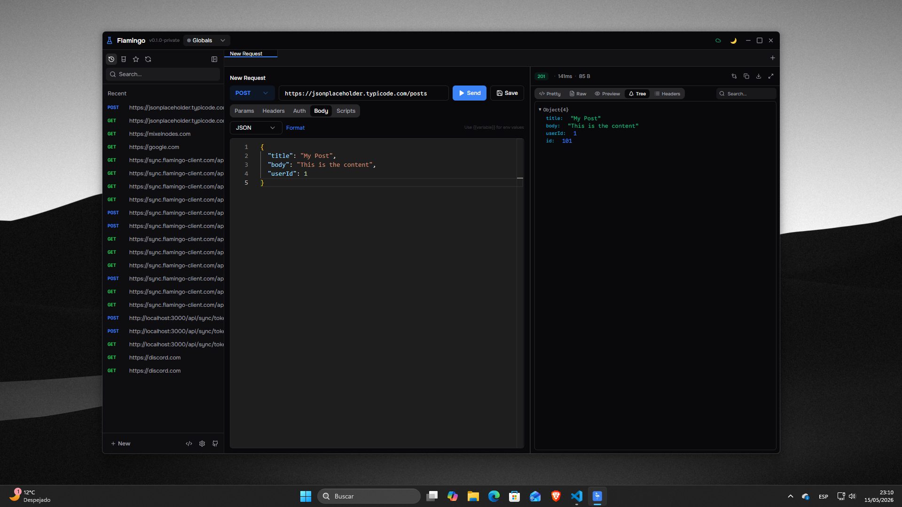

<div align="center">
  
  <h1>Flamingo</h1>
  <p><b>A modern, high-performance desktop API client.</b></p>
  <p>Craft HTTP requests, manage environments and collections, and sync across devices with end-to-end encryption.</p>
  <sub>Electron · React · TypeScript · MIT licensed</sub>
</div>



## Features

**Requests**
- Full request builder for `GET`, `POST`, `PUT`, `PATCH`, `DELETE`, `HEAD` and `OPTIONS`
- Headers, query params and bodies (JSON, XML, text, form-data, URL-encoded)
- Auth presets: Basic, Bearer token and API key
- Paste a `curl` command straight into the URL bar and it becomes a request
- Pre-request and post-response scripts with a captured `console` output panel

**Responses**
- Pretty, raw, preview, JSON tree and headers views
- Status, latency and payload size at a glance
- Side-by-side diff of two responses from different tabs
- Copy or download the body in one click

**Workspace**
- Multi-tab editing with pinning, duplication and middle-click to close
- Command palette on `Ctrl+K`
- Collections for grouping saved requests, plus searchable request history
- Environment variables resolved as `{{variable}}` in URLs, headers and bodies
- Light, dark and system themes, applied to the Monaco editor as well

**Sync**
- Optional cloud sync with AES-256-GCM end-to-end encryption
- Per-category opt-in: history, environments, collections, secrets, settings

## Getting started

Requires **Node.js 18+** and **pnpm** (the repo ships a `pnpm-lock.yaml` and a `pnpm-workspace.yaml`).

```bash
pnpm install
pnpm electron:dev     # Vite + Electron together, with hot reload
pnpm react:dev        # Vite dev server only, on http://localhost:5173
```

To attach Electron to a dev server you already have running, use `electron . --dev`.

### Build

```bash
pnpm react:build      # Type-check, then produce the Vite bundle in dist/
pnpm build            # Full build, then package for Windows + Linux
pnpm electron:build   # Full build, then package for the current platform
```

`electron:win`, `electron:linux` and `electron:mac` package an **existing** `dist/` for a single target, so run `react:build` first if the bundle is stale. Packaging for macOS needs Xcode, an Apple Developer account and valid signing certificates.

### Scripts

| Script | What it does |
|--------|--------------|
| `react:dev` | Vite dev server on port 5173 |
| `react:build` | `tsc` type-check + Vite production bundle |
| `electron:dev` | Bundle, then run Vite and Electron concurrently |
| `electron:build` | `react:build` + package for the current platform |
| `electron:win` | Package an existing `dist/` as an NSIS installer |
| `electron:linux` | Package an existing `dist/` as AppImage + deb |
| `electron:mac` | Package an existing `dist/` as DMG + ZIP |
| `build` | `react:build` + package for Windows and Linux |
| `preview` | Serve the production bundle in a browser |
| `lint` | `tsc --noEmit` |

## Architecture

```
.
├── electron/
│   ├── main.js              # BrowserWindow, IPC handlers, window controls
│   └── preload.js           # contextBridge — the only surface exposed to the renderer
├── public/                  # Static assets copied verbatim (fonts, logo)
└── src/
    ├── components/
    │   ├── layout/          # TitleBar
    │   ├── request/         # RequestBuilder, BodyEditor, KeyValueEditor
    │   ├── response/        # ResponseViewer, ResponseCompare
    │   ├── sidebar/         # Sidebar + History/Collections/Environments/Favorites/Sync panels
    │   ├── ui/              # Primitives: Button, Input, Select, Modal, Tabs…
    │   └── workspace/       # TabBar, CommandPalette
    ├── lib/
    │   ├── sync/            # Sync client, crypto, store, provider
    │   ├── curl-parser.ts   # curl → request
    │   ├── monaco-setup.ts  # Editor themes matching the app surfaces
    │   ├── script-runner.ts # Pre/post request scripts
    │   └── utils.ts
    ├── main/                # App entry point and root component
    ├── stores/              # Zustand stores
    └── styles/              # Design tokens and global CSS
```

### State

Every domain gets its own Zustand store, most behind the `persist` middleware:

| Store | Holds | Persisted |
|-------|-------|-----------|
| `tab-store` | Open tabs, active tab, request drafts, responses | Yes |
| `history-store` | Past requests | Yes |
| `collection-store` | Collections and folder state | Yes |
| `environment-store` | Environments and their variables | Yes |
| `settings-store` | Font size, timeout, behaviour toggles | Yes |
| `theme-store` | Theme preference | Yes |
| `ui-store` | Sidebar collapse, modal visibility | No |

### Sync

Flamingo talks to the Flamingo Sync Server, and the server never sees plaintext:

1. A random 256-bit master key is generated on the client at first connection
2. Everything is encrypted with AES-256-GCM via the Web Crypto API before upload
3. Extra devices fetch the shared master key through a device-authorization flow
4. Each category syncs only if you enable it

### Design system

The interface runs on CSS custom properties, exposed to Tailwind as RGB channels so opacity modifiers keep working. Both themes live in `src/styles/globals.css`; no component hardcodes a colour.

| Token | Role |
|-------|------|
| `canvas` | Window background, behind everything |
| `surface` / `surface-raised` / `surface-sunken` | Panels, popovers, insets |
| `line` / `line-strong` | Borders and dividers |
| `body` / `muted` / `faint` | Text hierarchy |
| `accent` / `accent-foreground` | Primary actions — ink on light, white on dark |
| `good` / `warn` / `bad` | Status feedback |
| `method-*` | Per-HTTP-method colours, colour-blind safe |

## Keyboard shortcuts

| Shortcut | Action |
|----------|--------|
| `Ctrl+Enter` | Send the current request |
| `Ctrl+K` | Open the command palette |
| `Ctrl+T` | New tab |
| `Ctrl+B` | Toggle the sidebar |

## Tech stack

| Layer | Technology |
|-------|-----------|
| Desktop shell | Electron 43 |
| UI | React 18 |
| Build | Vite 5 |
| Language | TypeScript 5 |
| Styling | Tailwind CSS 3 |
| Components | Radix UI primitives |
| State | Zustand 5 |
| Editor | Monaco (the VS Code engine) |
| Animation | Framer Motion 11 |
| Icons | Lucide |
| Encryption | Web Crypto API (AES-256-GCM) |

## License

MIT — see [LICENSE](./LICENSE). Copyright © 2024 Javier Fernández (Jallox/Jayox)
